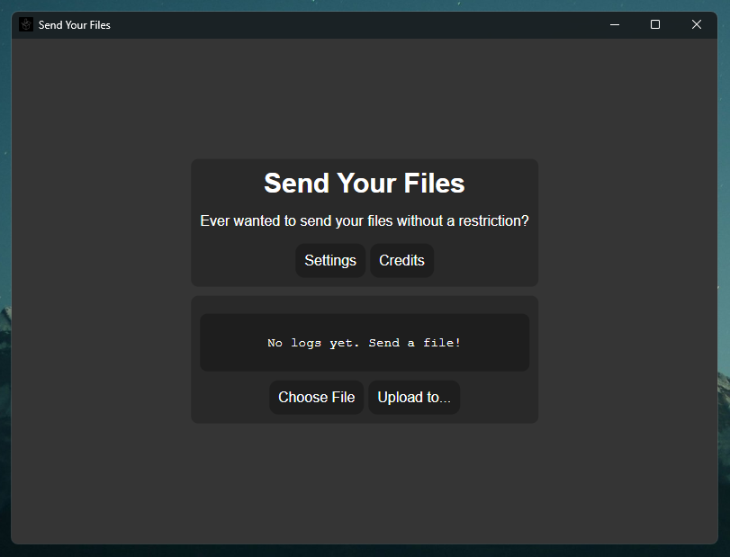
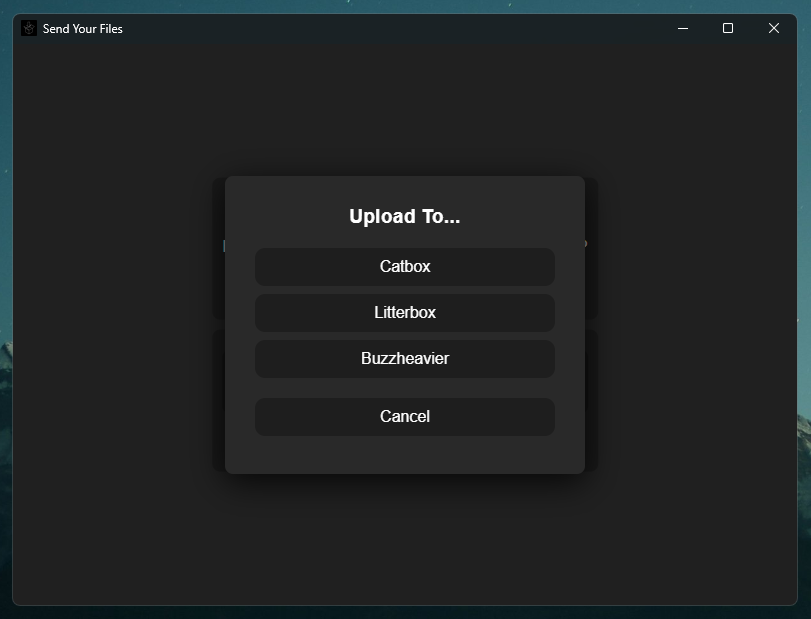

  
  <h1>Send Your Files Project</h1>
  
Wanna send your silly files above 10 mb? Here's an app for you! Native for Windows, Linux, MacOS and Android!

  

# Preview

  
  
  

# Download links
<ul>
  <h2> Stable Release </h2>
  <li><a href="https://github.com/daveberrys/SendYourFiles/releases"> Page to stable release, here! </a></li>
</ul>

<ul>
  <h2> Nightly Release </h2>
  <li><a href="https://nightly.link/daveberrys/SendYourFIles/workflows/building/main/SendYourFiles-Windows.zip"> Windows </a></li>
  <li><a href="https://nightly.link/daveberrys/SendYourFIles/workflows/building/main/SendYourFiles-MacOS.zip"> macOS </a></li>
  <li><a href="https://nightly.link/daveberrys/SendYourFIles/workflows/building/main/SendYourFiles-Linux.zip"> Linux </a></li>
</ul>

# Why did we make this?
We didn't like Discord's 10 mb restriction. We usually have big files, like zips, videos and such.
So, Daveberry and Runyra made this program for you all to not suffer with the 10mb hell!

We hope you, as the user, enjoy our software and give us a star if you love and keep on using this software.
It gives us more motivation to keep continuing this project and making this app better.

# What we use:
## Programming language:
- Python (3.13)

## Python Libraries:
- Request
- PyInstaller
- PyWebView

# Contributors
## Lead devs
- Daveberry
  - Programmer (Front & Back)
  - UI Designing
- Runyra
  - Nothing at all. (for now lmao)
