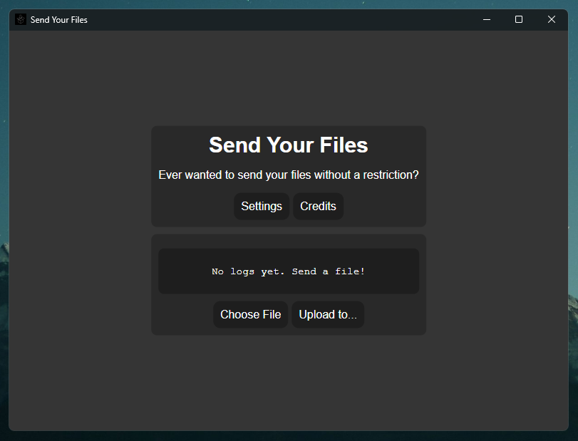
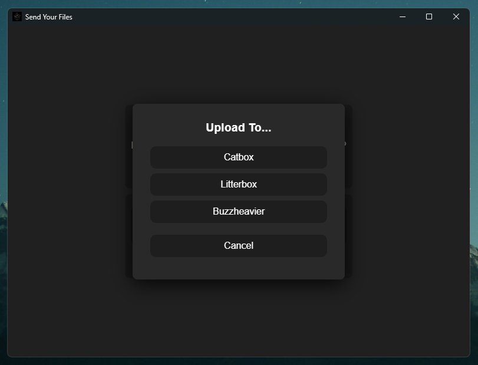
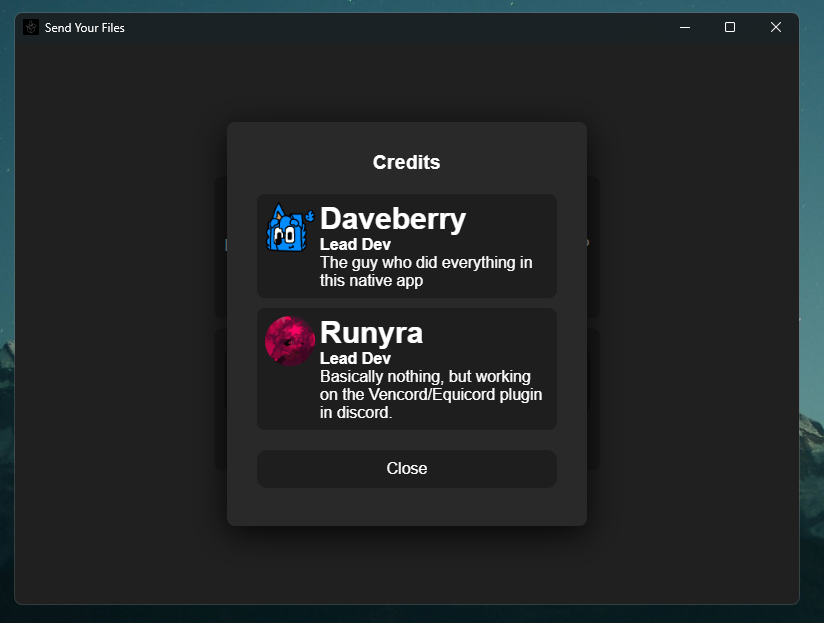

<div align="center">
  
  <h1>Send Your Files Project</h1>
  <p>Wanna send your silly files above 10 mb? Here's an app for you! Native for Windows, Linux, MacOS! (android coming soon... probably-)</p>
  
</div>

> [!IMPORTANT]
> Linux is bugged and barely working. Check [Running the app](https://github.com/PinpointTools/SendYourFiles/tree/main?tab=readme-ov-file#running-the-app) and [Compiling the app](https://github.com/PinpointTools/SendYourFiles/tree/main?tab=readme-ov-file#compiling-the-app). You can help us by submitting a PR or just do a Issue and tell us how'd you fix it.

# Preview
<div align="center">
  
  
  
</div>

# Download links
<ul>
  <h2> Stable Release </h2>
  <li><a href="https://github.com/daveberrys/SendYourFiles/releases"> Page to stable release, here! </a></li>
</ul>

<ul>
  <h2> Nightly Release </h2>
  <li><a href="https://nightly.link/daveberrys/SendYourFIles/workflows/building/main/SendYourFiles-Windows.zip"> Windows </a></li>
  <li><a href="https://nightly.link/daveberrys/SendYourFIles/workflows/building/main/SendYourFiles-MacOS.zip"> macOS </a></li>
  <li><a href="https://nightly.link/daveberrys/SendYourFIles/workflows/building/main/SendYourFiles-Linux.zip"> Linux </a></li>
</ul>

# Why did we make this?
We didn't like Discord's 10 mb restriction. We usually have big files, like zips, videos and such.
So, Daveberry and Runyra made this program for you all to not suffer with the 10mb hell!

We hope you, as the user, enjoy our software and give us a star if you love and keep on using this software.
It gives us more motivation to keep continuing this project and making this app better.

# Running the app
## WINDOWS
In **Windows**, you just need [WebView2 over here](https://developer.microsoft.com/en-us/microsoft-edge/webview2?form=MA13LH#download) and then you can run it.

## LINUX
In **Linux**, it's a bit of a tricky set up.

If you tried to open the app with the required dependencies, it'll say something like `webview.errors.WebViewException: You must have either QT or GTK with Python extensions installed in order to use pywebview.` which won't ever open the app unless you have GTK webview.

We might have to switch to Qt, as it is stable enough. Although, by using Qt, we'd have to sacrifice RAM and Storage.

## MACOS
Just open the app and you're done. No need to download anything else other than the app.

# Compiling the app
## WINDOWS
It's simple, really.
```powershell
git clone https://github.com/PinpointTools/SendYourFiles/
cd SendYourFiles
python3 -m venv venv
venv\Scripts\pip install -r requirements.txt
venv\Scripts\pyinstaller build.spec
```

## LINUX
Linux is... Compilcated. As of right now, I only compiled for Ubuntu using Distrobox.

First of all, you're gonna have to install developer dependencies. Make sure you already have `python3`, `python3-pip` and `python3-venv` installed before this!
```bash
sudo apt update
sudo apt install -y \
  build-essential \
  pkg-config \
  python3-dev \
  libcairo2-dev \
  libgirepository1.0-dev \
  libwebkit2gtk-4.1-dev \
  libgtk-3-dev \
  gir1.2-gtk-3.0 \
  gir1.2-webkit2-4.1 \
  libayatana-appindicator3-dev \
  gir1.2-ayatanaappindicator3-0.1 \
  dbus \
  libdbus-1-dev \
  gir1.2-dbusmenu-gtk3-0.4 \
  gir1.2-dbus-1.0
```
Once that's done, just do this commands and you're done.
```bash
git clone https://github.com/PinpointTools/SendYourFiles/
cd SendYourFiles
python3 -m venv venv
venv/Scripts/pip install -r requirements.txt
venv/Scripts/pyinstaller build.spec
```

## MACOS
Like windows, this is also insanely simple.
```bash
git clone https://github.com/PinpointTools/SendYourFiles/
cd SendYourFiles
python3 -m venv venv
venv/Scripts/pip install -r requirements.txt
venv/Scripts/pyinstaller build.spec
```

#

# Questions
- **Q: Will you guys ever compile for web version?**
- A: Probably. [I've](https://codedave.pages.dev) been thinking about it and [I](https://codedave.pages.dev) probably will. [I'd](https://codedave.pages.dev) do something like using vercel or cloudflare to host the website. 
>
- **Q: Why make it native?**
- A: [I](https://codedave.pages.dev) never liked the idea of just opening in your browser, getting your file and uploading it. [I](https://codedave.pages.dev) liked the idea of where you just open from your system tray and upload it.
>
- **Q: Why is it made in python with pywebview?**
- A: 'Cause, it's easy and simple. [I](https://codedave.pages.dev) don't want to make it in rust since... It's just an app that uploads things. And pywebview? [I](https://codedave.pages.dev) like using HTML, CSS and JS/TS. [I](https://codedave.pages.dev) feel comfortable with my workflow.
>
- **Q: I want to enhance this app.**
- A: Read [Contributing](CONTRIBUTING.md) first and then you can submit a PR.
>
- **Q: Why is there no mobile version of this app yet?**
- A: There probably be none. [I](https://codedave.pages.dev) wanted to make one, but honestly, it'll just take forever to implement mobile.